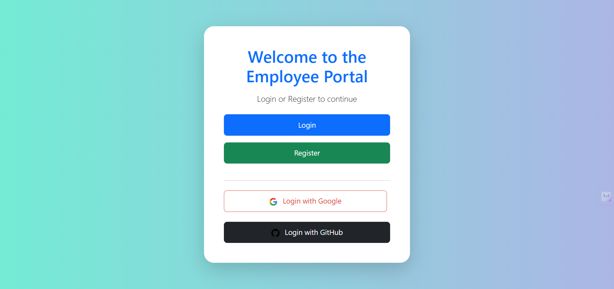
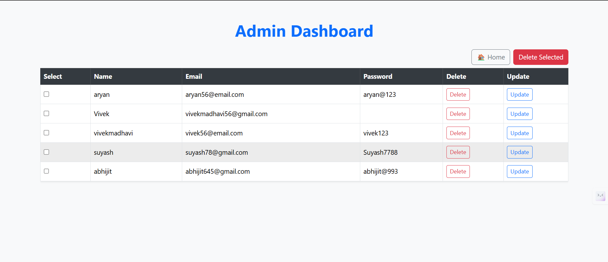

# 🛡️ Laravel Portal with Admin & Employee Roles

A Laravel-based portal that supports:

- Admin and Employee login system  
- CRUD operations for employee data (admin only)  
- Google and GitHub OAuth login  
- Secure session handling  
- Mysql (e.g., Supabase) database support  

---

## 🚀 Features

- ✅ Login & Registration (with password or social login)  
- ✅ Role-based dashboard (Admin/Employee)  
- ✅ Admin can manage (Create, Read, Update, Delete) employees  
- ✅ Employees can view their profile only  
- ✅ Integrated Google & GitHub OAuth using Laravel Socialite  
- ✅ Styled using Bootstrap 5  
- ✅ Works with mysql (e.g., Supabase)  

---

## 📸 Screenshots

### 🔐 Login with Google & GitHub  


### 📊 Admin Dashboard  


---

## 🔑 Default Admin Login

To access the admin dashboard:  

- **Email:** `admin`  
- **Password:** `admin`  

---

## ⚙️ Tech Stack

- Laravel 11+  
- PostgreSQL / Supabase  
- Laravel Socialite (OAuth)  
- Bootstrap 5  

---

## 🧑‍💻 Installation

```bash
git clone https://github.com/your-username/laravel-portal.git
cd laravel-portal
composer install
npm install && npm run dev
cp .env.example .env
php artisan key:generate
